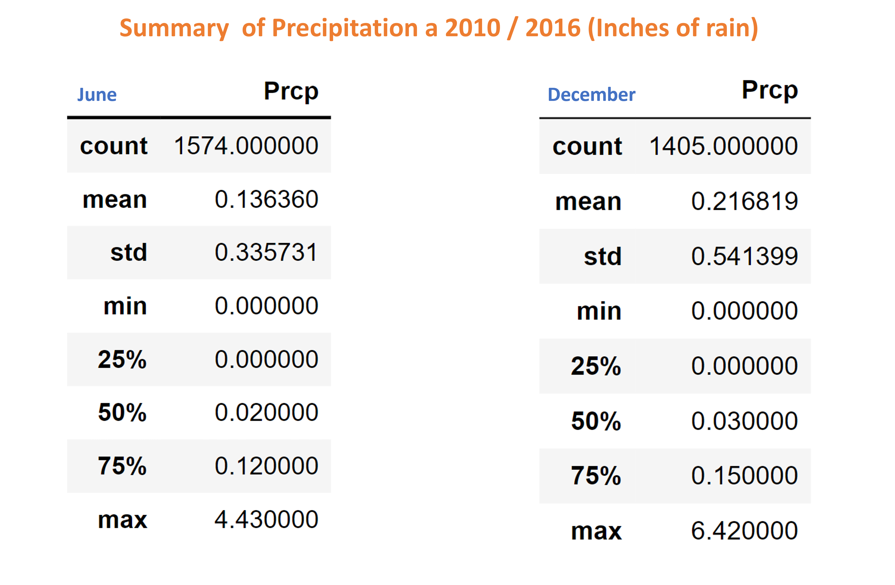
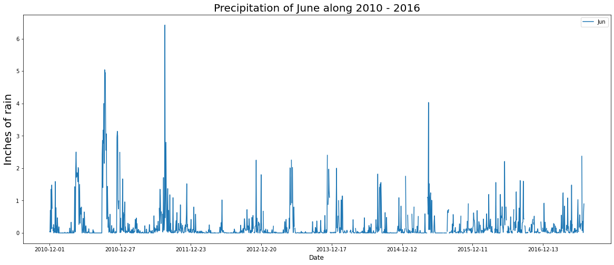
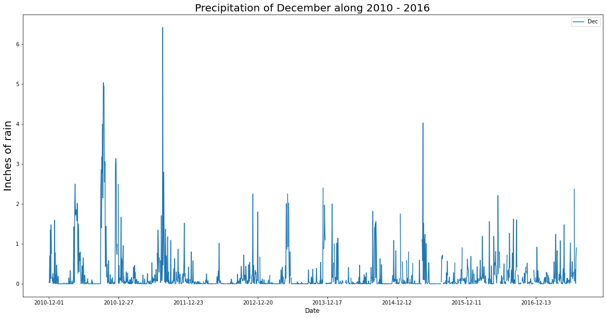

# Surfs_up Challenge
###### Challenge Module 9
____________________________________________________

# Overview
W. Avy wants more information about temperature trends before opening the surf shop. He wants to know if the  business is sustainable year-round. The present analysis is from the months of June and December along 2010 to 2017. 

# Results

### Statics resume from June and December over the years

### Differences in weather between June and December

    - The minimum temperature in June is 64ºF and in December it is 56ºF, +-10 degrees for the difference
    - The maximum temperature in June is 85ºF and in December it is 83ºF, +-2 degrees for the difference
    - Average temperature is almost the same + -3 degrees
    - The standard deviation is approximately +-3.5 degrees from the average, in June and December.
    - June is not too hot and December is not too cold. Oahu has a pleasant climate.

###### NOTE : The differences in the count of the measures are not significant.

### Histogram of the frequency of temperature measurement for June and December during 2010 - 2017

# Summary

The average temperature variation in June and December is +-3 degrees, for 7 years. In June the average temperature is 75ºF and in December 71ºF. It is possible to say that the climate is stable and warm.

The analysis of pluvial precipitation was also carried out in the months of June and December.

### Statics resume from June and December over the years

### Precipitation for June during 2010 - 2017

### Precipitation for December during 2010 - 2017

Oahu seems like a good place to start a surf business, with good weather and light rain, which helps to have a good day in the waves and then enjoy an ice cream.