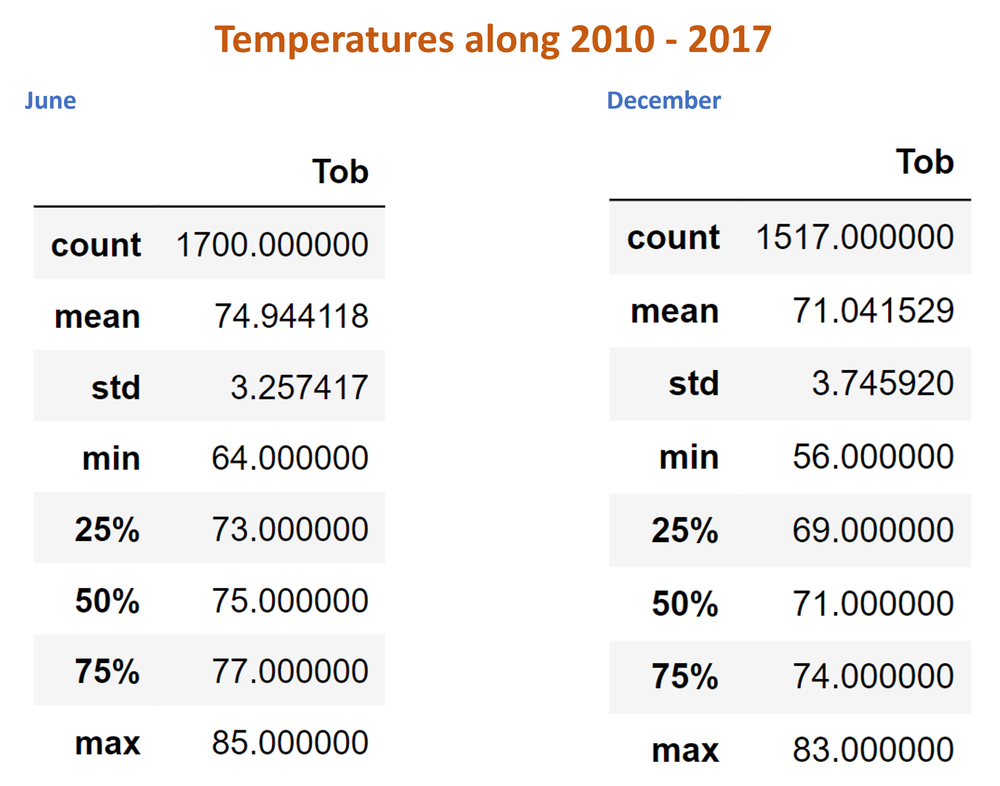
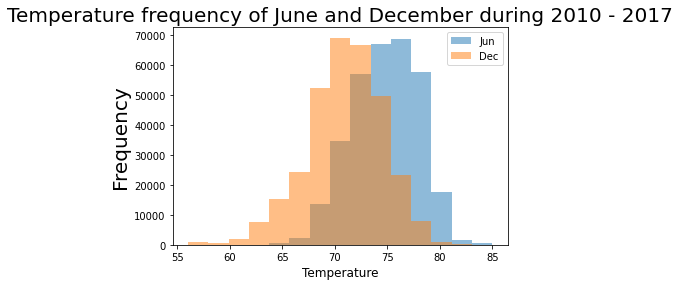

# Surfs_up Challenge
###### Challenge Module 9
____________________________________________________

# Overview
W. Avy wants more information about temperature trends before opening the surf shop. He wants to know if the  business is sustainable year-round. The present analysis is from the months of June and December along 2010 to 2017. 

# Results

### Statics resume from June over the years

### Histogram of the frequency of temperature measurement for June and December during 2010 - 2017

# Summary

The average temperature variation in June and December is + -3 degrees, for 7 years. In June the average temperature is 75ºF and in December 71ºF. It is possible to say that the climate is stable and warm.

Oahu seems a good place to start a surf business.